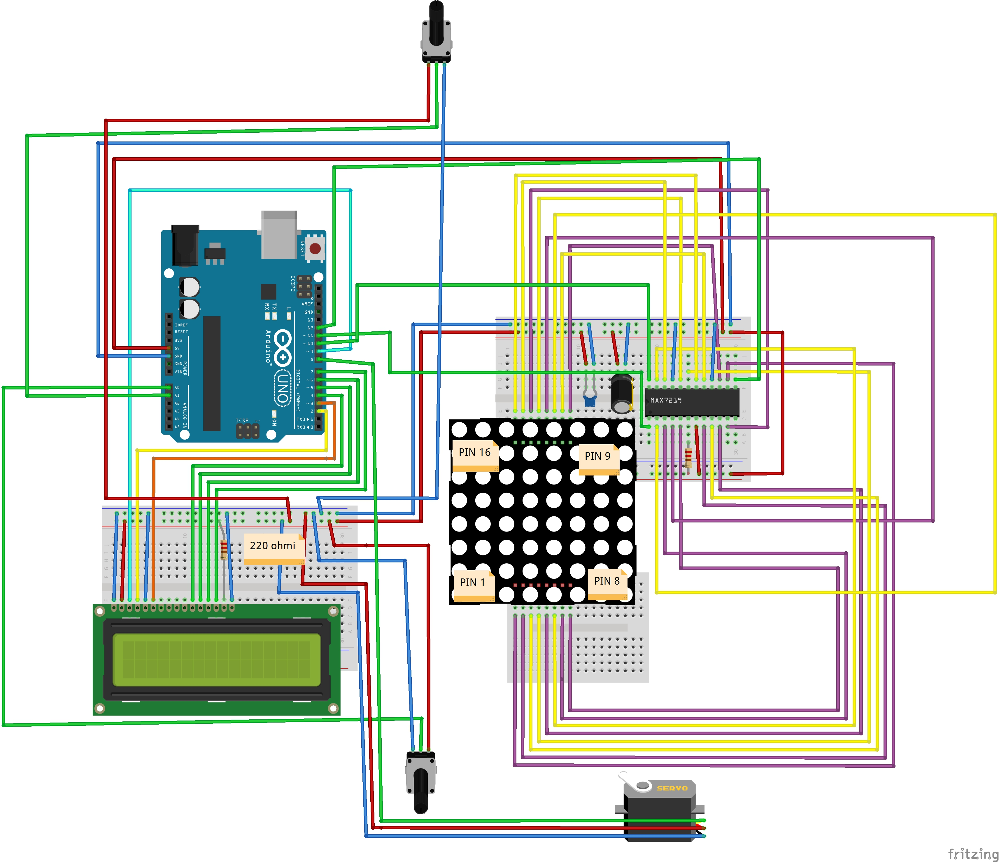
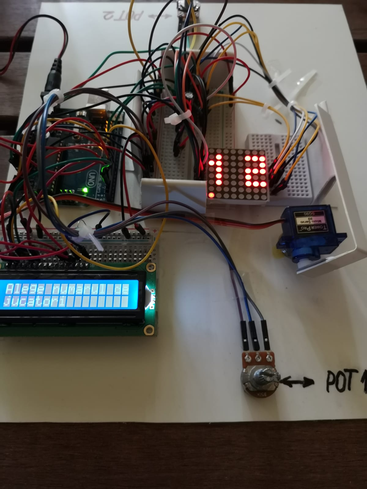
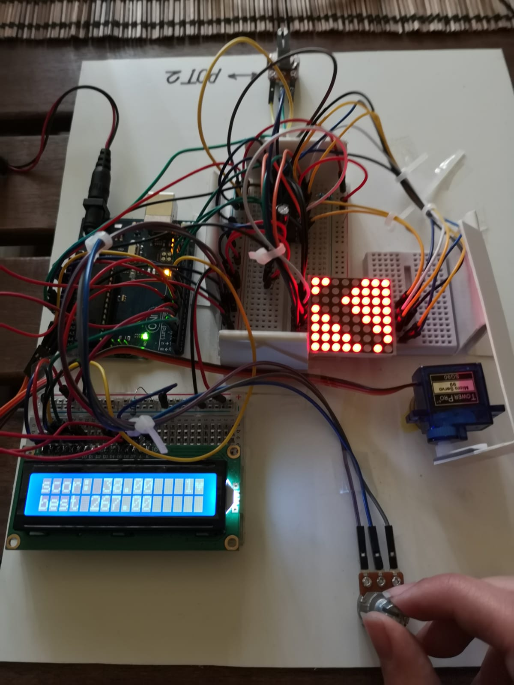
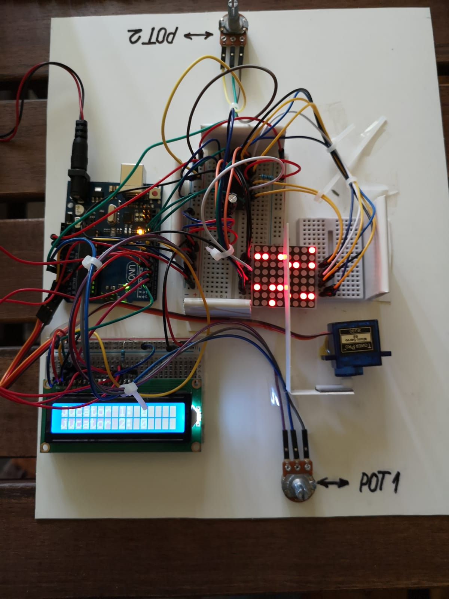

# Ardrumino
### Componente necesare
Breadboard mediu x2; Breadboard mic; Potentiometru x2; Lcd; Matrice led-uri 8x8; Servo; Fire mama-tata x9; Multe fire tata-tata; Rezistenta 220; Rezistenta 10k; Arduino uno; Modul MAX7219; Condensator 10uF; Condensator 0.1uF

### Despre joc
Ardrumino este un joc tip arcade, care poate fi jucat de una sau doua persoane. 
Odata conectat la o sursa electrica, trebuie setat potentiometrul principal (POT1 in poza) la o valoare de mijloc, cu ajutorul indicatiilor vizualizate pe lcd si a sagetilor de pe matricea de led-uri. Apoi, jucatorul va selecta modul de joc (single player sau multiplayer) 

### Modul de un jucator
Filmulet demonstrativ: https://drive.google.com/open?id=1hR8wtvw8donYwkLuwgBK7vzdQ5x46ktT

In acest mod, jucatorul (care realizează mișcările cu ajutorul potentiometrului principal), reprezentat pe matrice ca un punct care palpaie, trebuie sa evite led-urile aprinse de pe matrice (acestea iau forma unui drum). In timpul jocului, sunt afisate pe lcd informatii precum scorul curent, highscore-ul si numarul de vieti ramase in joc. La contactul cu unul din led urile aprinse, jucatorul pierde o viata, iar obstacolele dispar, urmand sa fie generate din nou dupa 1-2 secunde. Odata epuizate cele 3 vieti, vor fi afisate urmatoarele, in functie de caz: o fata trista, daca highscore ul nu a fost depasit, si o fata fericita, in caz contrar.
Informatiile despre jocul pierdut vor ramane afisate pe matrice si lcd pana la interactiunea utilizatorului (pana cand potentiometrul principal este miscat). Atunci, se revine la meniul cu alegerea numarului de jucatori. 

### Modul de doi jucatori:
Filmulet demonstrativ: https://drive.google.com/open?id=1_zCfG5ZYwIlpG-jSXRLfjSCYKgqL3uSB

Cand este selectat acest mod de joc, un cartonas, actionat de servo, coboara pe mijlocul matricei pentru a delimita spatiul de joc al fiecarui utilizator. Astfel, fiecare jucator va avea alocata jumatatea matricei din stanga sa. Similar variantei de un player, jucatorii sunt reprezentati prin cate un led care palpaie, iar acestia trebuie sa evite obstacolele (led urile aprinse). Obstacolele vor fi aceleasi pentru ambii jucatori. In timpul jocului, pe lcd este afisat scorul fiecarui jucator (cate jocuri a castigat fiecare). Cand unul din participanti ajunge la 3 partide castigate, jocul se opreste, iar pe suprafata de joc a fiecarui jucator (pe jumatatea sa de matrice) sunt este afisata cate o fata trista sau fericita, dupa caz. Informatiile despre jocul pierdut vor ramane afisate pe matrice si lcd pana la interactiunea utilizatorului (pana cand potentiometrul principal este miscat). Atunci, se revine la meniul cu alegerea numarului de jucatori. 

